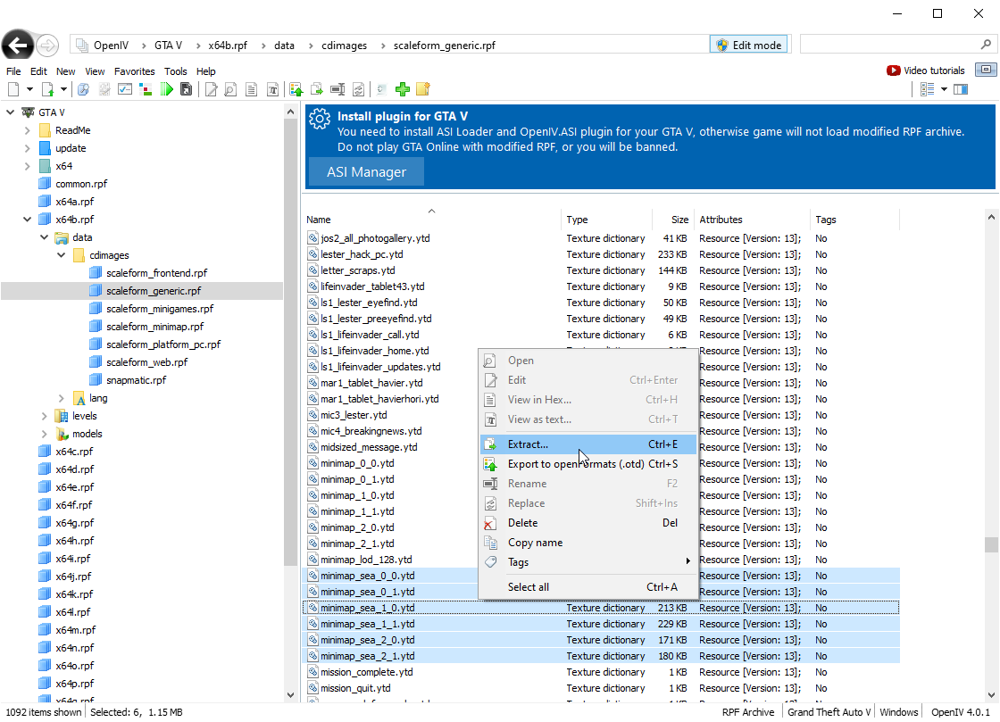

# Custom Images

It's possible to have custom map images in LiveMap.
You can do this if you want LiveMap to show the same map that you have in game, cool right?

It's a bit of an involved process but, if you're willing to put in the time, the result is worth it.

Note: You must have [Python 3](https://www.python.org/downloads/) installed.

- [Custom Images](#custom-images)
  - [Step 1: Extract YTD](#step-1-extract-ytd)
  - [Step 2: Installing Pillow](#step-2-installing-pillow)
  - [Step 3: Getting the Images](#step-3-getting-the-images)
  - [Step 4: Configure the map](#step-4-configure-the-map)

## Step 1: Extract YTD
If you have a custom map in FiveM then, you should already have the YTD files.

If not, then you can extract them from GTA using [OpenIV](https://openiv.com/).
The default path for the minimap files is `GTA V\x64b.rpf\data\cdimages\scaleform_generic.rpf\`.
I recommend that you extract the `minimap_sea` files if they are available as they're generally higher quality.



I recommend you extract the files into the [images/tiles](https://github.com/TGRHavoc/live_map-interface/tree/master/images/tiles) directory.
If not, make sure to copy the Python scripts to the same directory as your YTD files.

## Step 2: Installing Pillow

Time to install [Pillow](https://pypi.org/project/Pillow/).

```shell
❯ python -m pip install Pillow
```

## Step 3: Getting the Images

This set is as easy as `python extract_png.py`.

This should output something like the following:
```shell
 live_map-interface\images\tiles  @4.0.1   develop ± 
❯ python extract_png.py
minimap_sea_0_0.ytd
Magic: b'RSC7', 0x37435352
Version in header: 13
System flag = 131072, Graphics flag = 3489660947
Calculated version '13'. Valid RSC7 header
Shift (system) : 0
Shift (gfx) : 3
Size calculated: 1056784, Size of system: 8192, Size of gfx: 1048576. SIZE: 190009
--- SNIP ---
Read name: minimap_sea_2_1
Reading from GFX
Done
```

This should give you some PNG files!


Put these into their own folder.

For example: `new-map`
```shell
new-map/
--- minimap_sea_0_0.png
--- minimap_sea_0_1.png
--- minimap_sea_1_0.png
--- minimap_sea_1_1.png
--- minimap_sea_2_0.png
--- minimap_sea_2_1.png
```

## Step 4: Configure the map

Make sure you add the new map images to `config.json`.
Using the example above, you would add the following to the [maps section of the config](config.md#config.json).

```json
{
    "name": "New Map",
    "url": "{tileDirectory}/new-map/minimap_sea_{y}_{x}.png",
    "minZoom": -2 // Set lower to zoom out more
}
```

So, it would look like
```json
"maps" : [
    {
        "name": "Normal",
        "url": "{tileDirectory}/normal/minimap_sea_{y}_{x}.png",
        "minZoom": -2 // Set lower to zoom out more
    },
    {
        "name": "New Map",
        "url": "{tileDirectory}/new-map/minimap_sea_{y}_{x}.png",
        "minZoom": -2 // Set lower to zoom out more
    },
    {
        "name": "Postal",
        "url": "{tileDirectory}/postal/minimap_sea_{y}_{x}.png",
        "minZoom": -3 // Since this is 3 times bigger, just remove 3 from the default minZoom
    }
]
```

If you _just_ wanted the new map, that would be the only entry:
```json
"maps" : [
    {
        "name": "New Map",
        "url": "{tileDirectory}/new-map/minimap_sea_{y}_{x}.png",
        "minZoom": -2 // Set lower to zoom out more
    }
]
```
